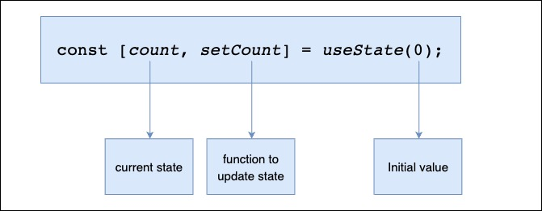

## React Hooks

## useState Hooks structure



## Hooks

> Fundamental Hooks
* useState
* useEffect
* useContext

> Important Hooks
* useRef
* useMemo
* useCallback
* useReducer
* useTransition
* useDeferredValue

>Optional Hooks
* useLayoutEffect
* useDebugValue
* useImperativeHandle
* useId

>Custom Hook


## React Hooks rules

* Hooks can not implement into class component, only into function component

```js

import React, {useState} from "react";

function App() {
    const [state, setState] = useState(false)

    return (
        <>
            code here
        </>
    )
} 
```
* Hooks must be execute into same sequential order 

```js
function App() {
    useState()
    useState()
    useState()

    return (
        <>
            code here
        </>
    )
} 

```
* hooks should not be inside into control statement, loops or anything else

```js
function App() {
    
    //should not be
    if(condition){
        useState()
    }

    return (
        <>
            code here
        </>
    )
} 

```

### useEffect()

* side effect

### useRef()

* Ref use for accessing DOM elements.
* Ref is always an object with a single `.current` property which is set to the current value of the Ref.

### useMemo()

* useMemo is use for performance the React project
* It is actually do the cache of the components or value

```js
const result = useMemo(() => {
  return slowFunction(a)
}, [a])
```

### useCallback()

useCallback works almost same to useMemo since it will cache a result based on an array of dependencies, but useCallback is used specifically for caching functions instead of caching values.

The only difference between useMemo and useCallback is that useCallback is for memoizing functions while useMemo is for memoizing anything you want.

```js
useCallback(() => {
  return a + b
}, [a, b])

useMemo(() => {
  return () => a + b
}, [a, b])
```

### useReducer()
### useTransition()
### useTransition()
### useDeferredValue()

### useId()

useId() use for generate unique ids for use within HTML elements.

## Custom Hooks


## useCases

* window Width
* Stop Watch


----------
## Resources

* [React Hooks Simplified by Kyle](https://courses.webdevsimplified.com/view/courses/react-hooks-simplified)
* [Dmitri Posts](https://dmitripavlutin.com/tag/react/)
* 

